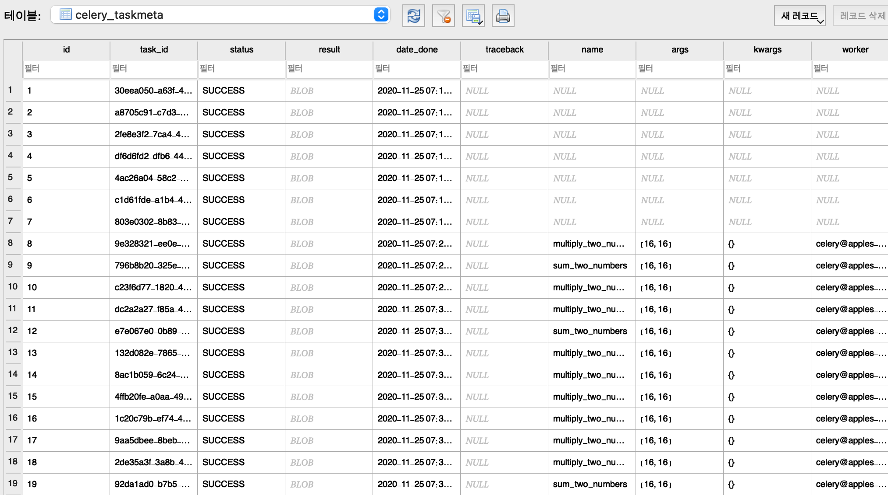

### Celery beat에서 생성된 TaskExtended 객체 출력(SQLAlchemy)

<br>

[result_backend](https://docs.celeryproject.org/en/latest/userguide/configuration.html?highlight=beat_scheduler#std-setting-result_backend)

[beat_schedule - entries](https://docs.celeryproject.org/en/latest/userguide/periodic-tasks.html#beat-entries)

[beat_scheduler](https://docs.celeryproject.org/en/latest/userguide/configuration.html?highlight=beat_scheduler#beat-scheduler)

```python
# celery.py 설정 코드
app.conf.broker_url = BASE_REDIS_URL
app.conf.result_backend = 'db+sqlite:///results.sqlite'  # sqlite로 결과 데이터 저장
app.conf.result_extended = True  # celery 작업에 대한 세부 데이터 저장
app.conf.beat_scheduler = 'django_celery_beat.schedulers.DatabaseScheduler'
app.conf.beat_schedule = {
    'add-every-minute-crontab': {
        'task': 'multiply_two_numbers',
        'schedule': crontab(hour=1, minute=3),
        'args': (16, 16),
    },
    'add-every-5-seconds': {
        'task': 'multiply_two_numbers',
        'schedule': timedelta(seconds=5),
        'args': (16, 16)
    },
    'add-every-30-seconds': {
        'task': 'sum_two_numbers',
        'schedule': timedelta(seconds=30),
        'args': (16, 16)
    },
}
```

-   sqlite로 설정했기 때문에 python에서 접근할 수 있도록 SQLAlchemy(pip install sqlalchemy)를 설치해야한다.

-   celery_beat에서 실행된 데이터는 result_backend로 설정된 데이터베이스의 celery_taskmeta 테이블에 저장된다.
    -   celery.backends.database.TaskExtended 객체가 celery_taskmeta 테이블로 저장됨.




<br>

```python
# django shell
>>> from celery.backends.database import TaskExtended
>>> from sqlalchemy import create_engine
>>> from sqlalchemy.ext.declarative import declarative_base
>>> from sqlalchemy.orm import scoped_session, sessionmaker
>>>
>>> engine = create_engine('sqlite:///results.sqlite', echo=True)
>>> db_session = scoped_session(sessionmaker(autocommit=False, autoflush=False, bind=engine))
>>> Base = declarative_base()
>>> Base.query = db_session.query_property()
>>>
>>> task = db_session.query(TaskExtended).get({"id":10})
>>> task
<Task c23f6d77-1820-4a17-ad2d-f0a7aabbf2c8 state: SUCCESS>
>>> task.result  
13312
>>> task.name
'multiply_two_numbers'
```

-   table에 result는 BLOB type이므로 직접 열어서 데이터를 확인해야할 경우 변환 처리가 필요하다.


